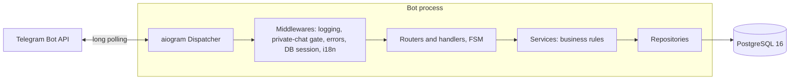
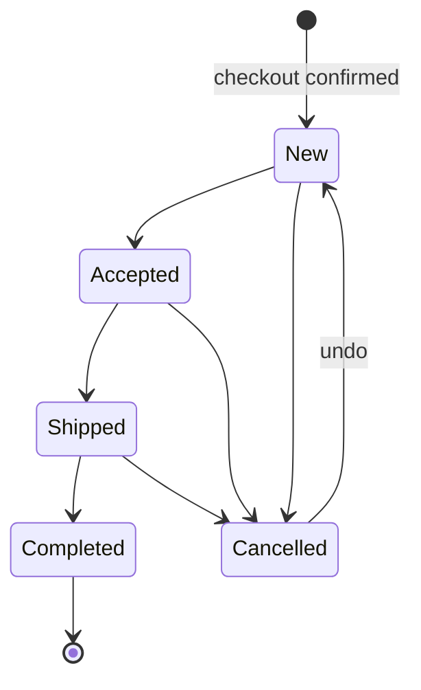

# V-Shop

**A production Telegram shop bot for an e-liquid store, with a transactional
loyalty system: a stamp card, a server-side prize roulette and a referral
programme.**

Python 3.13 · aiogram 3 · SQLAlchemy 2 (async) · PostgreSQL 16 · Alembic ·
Docker Compose · pytest

Customers browse a four-language catalog, manage a cart and check out through a
guided conversation; staff run the catalog, orders, broadcasts and statistics
from an admin panel inside Telegram. On top of the shop, every completed order
earns stamps towards a free bottle, milestone orders earn roulette spins, and
customers can invite friends — with rewards booked in the same database
transaction as the order event that earned them.

## Contents

- [Why this project is interesting](#why-this-project-is-interesting)
- [Features](#features)
- [Tech stack](#tech-stack)
- [Architecture](#architecture)
- [Core domain](#core-domain)
- [Loyalty system](#loyalty-system)
- [Order lifecycle](#order-lifecycle)
- [Security](#security)
- [Persistence and database](#persistence-and-database)
- [Testing](#testing)
- [CI/CD](#cicd)
- [Getting started](#getting-started)
- [Deployment](#deployment)
- [Project structure](#project-structure)
- [Engineering decisions and trade-offs](#engineering-decisions-and-trade-offs)
- [Known limitations and future work](#known-limitations-and-future-work)
- [Documentation](#documentation)
- [License](#license)

## Why this project is interesting

- **Rewards that cannot be double-booked.** Every stamp, spin and reward points at
  the event that caused it under a unique constraint, so a double tap, a
  redelivered Telegram update or a restart can never book anything twice.
- **Concurrency proven on a real database.** Loyalty operations take PostgreSQL
  row locks in one global order at READ COMMITTED; dedicated suites race real
  transactions and fail if the bot ever calls Telegram while holding a lock.
- **Transactional coupling to the order flow.** Completing an order books its
  stamps, milestone spin and referral payout in the status change's own
  transaction — status and rewards are durable together or not at all.
- **Nothing trusted from the client.** Callbacks carry ids only; prices, reward
  savings and roulette prizes (drawn with `secrets.randbelow`) are computed on
  the server.
- **A deploy cannot lose the database.** After a real incident in which a
  redeploy attached to an empty volume, the database volume became external with
  a required name, so a misconfigured deploy now refuses to start. Migrations
  never drop data, and this is enforced by tests.
- **End-to-end tests through the production dispatcher.** Real updates pass
  through every middleware, filter and FSM state; one journey runs in each of the
  four languages and checks that every screen fits on a phone.
- **Documentation pinned to the code.** Settings, tables, indexes, migrations and
  the middleware order are asserted against these documents by the test suite.

## Features

**Customers**
- Onboarding: language (`ru` / `en` / `de` / `uk`) and city (`berlin` / `delivery`)
- Catalog: category → brand → product, localized names and descriptions, product
  cards with photo, flavor, volume, nicotine strength and price
- Cart with quantity controls; checkout conversation with city-gated delivery
  (Berlin: `pickup` / `courier`; other cities: `postal` / `service`), address,
  preferred time, contact and payment method (`cash` / `card`)
- Order status notifications in the customer's own language
- 🪪 **My Stamp Card**, 🎰 **Lucky Roulette**, 👥 **Invite a Friend**, and loyalty
  rewards chosen at checkout (see [Loyalty system](#loyalty-system))
- Information pages (delivery, payment, contacts), an invite link to a private
  reviews group, and language or city changes at any time

**Admins** (`/admin`; `ADMIN_IDS`, or a temporary emergency session; private chats only)
- Products: add (four languages, category and brand), edit, change price or
  description, enable/disable, delete (refused when the product has order history)
- Categories and brands: create, rename per language, activate, reorder, delete,
  move a brand to another category
- Orders: new / completed lists, search, the full status lifecycle, and
  new-order alerts to a manager chat
- Statistics: orders and completed revenue for all time, this month and last
  month, plus best- and worst-selling products, with month boundaries in the
  shop's time zone
- Broadcasts: text or photo to all customers, paced to Telegram's limits
- 🪪 Loyalty: credit stamps to a customer by hand (`/admin_adjust_stamps`) —
  through the stamp ledger, recorded with the operator as its author, confirmed
  once, and silent: no message to the customer, none to the manager chat
- Emergency access: `/emergency_admin` opens a time-boxed admin session for an
  operator who is *not* in `ADMIN_IDS`, against a configured password hash, with
  a lockout after repeated failures; it never adds anyone to `ADMIN_IDS`

Details: [Admin guide](docs/admin-guide.md).

## Tech stack

| Layer | Technology |
|---|---|
| Runtime | Python 3.13, asyncio |
| Telegram | aiogram 3 (long polling, FSM, routers, middlewares) |
| Data access | SQLAlchemy 2 async ORM + asyncpg |
| Database | PostgreSQL 16 |
| Migrations | Alembic (linear, expand/contract) |
| Configuration | Pydantic Settings (validated at startup) |
| Deployment | Docker, Docker Compose |
| Quality | pytest + pytest-asyncio, ruff, mypy (strict) |

## Architecture



A layered design with dependencies pointing inward: handlers parse updates and
render screens, services hold the business rules, repositories hold the queries.
Each update gets one database transaction, committed by a middleware; handlers
commit early only where a Telegram message must follow a durable write, and never
await Telegram while holding a lock. Group chats are dropped before any database
work. More: [Architecture](docs/architecture.md).

## Core domain

| Concept | Notes |
|---|---|
| User | a Telegram account; language and city chosen at onboarding |
| Category → Brand → Product | three-level catalog; a product is *on sale* only when it, its category and its brand are active — one rule, used everywhere |
| Cart | one per user, persisted in PostgreSQL |
| Order | snapshot of prices, delivery and contact; status lifecycle below |
| Loyalty account | the cached stamp balance, the purchase count and the referral code |
| Stamp ledger | append-only record of every stamp movement, the source of truth |
| Spin grant / spin | an entitlement to spin, and the saved result of spending it |
| Reward | a free bottle or percentage discount, redeemed once at checkout |
| Referral | who invited whom; pending until the friend's first paid order completes |

## Loyalty system

### 🪪 Stamp Card

- One stamp per €20 of the order's charged total, booked when an admin marks the
  order **Completed** (€39.99 → 1, €40 → 2). Orders charged €0, and orders placed
  before the programme launched, earn nothing.
- 10 stamps unlock a free bottle — one product up to €20 — claimed with one tap
  and redeemed at checkout.
- One reward per order; rewards never expire.

### 🎰 Lucky Roulette

- Spins come from a one-time welcome spin (backfilled for existing customers at
  launch), every 5th qualifying purchase, and each qualified referral (to the
  referrer).
- Prizes: +1 stamp, +2 stamps, 5% off, 10% off, a free bottle. Default weights
  are 40 / 25 / 20 / 10 / 5, configurable by environment variables. The server
  draws with `secrets.randbelow`.
- A spin is consumed, recorded (with a prize snapshot) and paid out in one
  transaction; replaying the same button shows the saved result.

### 👥 Referral programme

- Every customer gets a personal deep link, `t.me/<bot>?start=ref_<code>`, with a
  72-bit random code.
- Only a customer who has never ordered can be referred; self-referrals, loops
  and re-attribution are refused, and the reply is identical for any code.
- When the friend's first paid order is completed, both sides get +2 stamps and
  the referrer a spin — once, in the completion's transaction.

All amounts are configurable ([Configuration](docs/configuration.md#loyalty-stamp-card)).
Details: [Loyalty](docs/loyalty.md) · [Roulette](docs/roulette.md) ·
[Referrals](docs/referrals.md).

## Order lifecycle



`Completed` is terminal and triggers the loyalty bookings. Transitions are
enforced by the service, not only by the keyboard, and the order row is locked,
so concurrent admin taps apply once and notify the customer once.

## Security

Admins are an allow-list of Telegram IDs that fails closed, behind two
independent gates; the same gates also admit a temporary emergency session,
opened with `/emergency_admin` against a scrypt hash in configuration and locked
out after repeated failures, expiring on its own and never touching `ADMIN_IDS`.
Group chats are ignored. Callbacks carry bounded, validated ids only, and
ownership is re-checked on the server and backed by composite foreign keys. Every
user-supplied value is HTML-escaped. Secrets stay in `.env`, and SQL bound
parameters never reach the logs. General rate limiting and container hardening
are out of scope for now; the full model, including what is out of scope, is in
[Security](docs/security.md).

## Persistence and database

Fourteen tables: eight for the shop, six for loyalty. Money is `numeric(10,2)` and
`Decimal` end to end. Loyalty tables use unique constraints as idempotency keys,
CHECK constraints for non-negative balances, and composite foreign keys that
stop cross-customer references. Nine Alembic migrations form a linear chain.
Upgrades only add; downgrades that would lose loyalty data refuse unless told
explicitly. Details: [Database schema](docs/database-schema.md).

In production the data lives in an **external Docker volume** that Compose
never creates or deletes; see [Deployment](docs/deployment.md#where-the-data-lives).

## Testing

2,266 tests at the time of writing:

- unit, integration and end-to-end tests through the production dispatcher;
- PostgreSQL concurrency and deployment suites;
- static migration guards and `alembic check` against the migrated schema;
- security, localization and documentation-drift tests.

```bash
python -m pytest tests -q        # SQLite; the 42 PostgreSQL tests skip without a database
```

How to run the PostgreSQL suites, and the full quality gate:
[Testing](docs/testing.md).

## CI/CD

No hosted CI/CD pipeline is configured. The quality gate is run locally before a
release, from a clean checkout:
1. formatting, lint and strict mypy;
2. the full suite on PostgreSQL with `VSHOP_TEST_NO_SKIPS=1`;
3. a migration round trip ending in `alembic check`;
4. the package build and a `--no-cache` Docker build.

Deployment is a manual Docker Compose procedure on the host.

## Getting started

### Quick start (Docker)

Requires Docker with the Compose v2 plugin and a bot token from
[@BotFather](https://t.me/BotFather).

```bash
cp .env.example .env
# Set BOT_TOKEN, ADMIN_IDS and MANAGER_CHAT_ID in .env, then create and name the
# database volume (upgrading an existing deployment? see docs/deployment.md first):
docker volume create vshop_pgdata
echo "POSTGRES_VOLUME_NAME=vshop_pgdata" >> .env

docker compose up --build
```

Compose starts PostgreSQL, waits for it to be healthy, runs `alembic upgrade head`,
then launches the bot. Send `/start` to your bot.

### Local development

```bash
python -m venv .venv
source .venv/bin/activate            # Windows: .venv\Scripts\activate
pip install -r requirements-dev.txt
pip install -e .

cp .env.example .env                 # DATABASE_URL defaults to localhost:5432
docker compose up -d db              # or any local PostgreSQL 16
alembic upgrade head
python -m app.main
```

Useful commands:

```bash
python -m pytest tests -q            # tests
ruff format --check . && ruff check .
mypy app                             # strict
python -m app.check_startup          # wiring + DB + Telegram getMe, without polling
```

### Configuration

| Variable | Required | Purpose |
|---|---|---|
| `BOT_TOKEN` | yes | Telegram Bot API token |
| `DATABASE_URL` | yes | async SQLAlchemy URL for host runs (Compose sets its own) |
| `MANAGER_CHAT_ID` | yes | chat receiving new-order alerts |
| `ADMIN_IDS` | for admin access | Telegram user IDs with admin rights; empty = no admins |
| `POSTGRES_VOLUME_NAME` | yes, under Compose | existing Docker volume holding the database |
| `POSTGRES_PASSWORD` | recommended | database password (the default `vshop` is for development only) |
| `LOYALTY_*`, `ROULETTE_*`, `REFERRAL_*`, `REFERRED_USER_START_STAMPS` | no | loyalty rules and roulette weights |

Every variable, with defaults and validation rules: [Configuration](docs/configuration.md).

### Database migrations

```bash
alembic upgrade head                 # applied automatically by the bot container on start
alembic check                        # the schema matches the models
```

Which downgrades are safe: [Deployment](docs/deployment.md#migrations).

## Deployment

The production setup is the included Compose stack: `vshop-db` (PostgreSQL 16)
and `vshop-bot`. On every start the bot applies migrations, checks the database,
logs which database cluster it attached to (`system_identifier` and row counts),
and backfills any missing loyalty accounts or welcome spins idempotently.

The runbook covers the safe update procedure, the checks to run after every
deploy (`python -m app.verify_deployment`), backups and restores, the operations
that must never be run (`docker compose down -v`, volume pruning), recovery if
the catalog looks empty, and a production checklist:
[Deployment](docs/deployment.md).

## Project structure

```text
.
├── app/
│   ├── main.py                # entry point: logging, bot, dispatcher, long polling
│   ├── bot.py                 # Bot (HTML parse mode) and Dispatcher (MemoryStorage) factories
│   ├── lifecycle.py           # startup: DB checks, identity log, loyalty activation, getMe
│   ├── config.py              # Pydantic Settings: every environment variable
│   ├── check_startup.py       # startup smoke check without polling
│   ├── verify_deployment.py   # read-only post-deploy report and loyalty integrity checks
│   ├── hash_emergency_password.py  # operator tool: the emergency password → its hash for .env
│   ├── handlers/
│   │   ├── user/              # start, emergency_admin, catalog, cart, checkout, stamp_card,
│   │   │                      # roulette, invite, info
│   │   ├── admin/             # panel, products, product_manage, categories, subcategories,
│   │   │                      # orders, broadcast, statistics, loyalty, settings, wizard_guard
│   │   └── fallback.py        # answers buttons that outlived their screen
│   ├── middlewares/           # request log, private-chat gate, errors, DB session, i18n, admin gate
│   ├── services/              # business rules: order, cart, catalog, admin, statistics,
│   │                          # loyalty, stamp_card, reward, roulette, roulette_engine,
│   │                          # spin_entitlement, referral, referral_program, notifications,
│   │                          # admin_access (sessions), emergency_admin (authentication)
│   ├── repositories/          # data access per aggregate; visibility.py = the "on sale" rule
│   ├── models/                # SQLAlchemy models and enums
│   ├── keyboards/             # keyboards and CALLBACK_* constants
│   ├── states/                # FSM state groups
│   ├── locales/               # four JSON catalogs with identical key sets
│   ├── utils/                 # validators, HTML escaping, i18n, display helpers, locks, cache,
│   │                          # password hashing (scrypt)
│   ├── errors/                # exception classification and safe user messages
│   ├── filters/, security/    # admin and localized-button filters; the one admin-access decision
│   └── database/              # async engine and session factory
├── alembic/                   # migrations (twelve, linear)
├── tests/                     # pytest suite; production_bot.py drives the real dispatcher
├── docs/                      # architecture, loyalty, roulette, referrals, database, …
├── docker/ca-certificates/    # optional build-time CA for TLS-intercepting networks
├── reports/                   # release audit notes
├── Dockerfile                 # python:3.13-slim image
├── docker-compose.yml         # db + bot, external database volume
├── pyproject.toml             # package metadata; ruff, mypy and pytest configuration
├── requirements.txt           # runtime dependencies
├── requirements-dev.txt       # plus test and lint tools
├── .env.example               # configuration template (placeholders only)
├── CHANGELOG.md
├── CLAUDE.md                  # guidance for AI coding assistants working in this repository
└── Product Requirements Document.txt   # the original requirements document
```

## Engineering decisions and trade-offs

- **Long polling** instead of webhooks: no inbound port, TLS endpoint or webhook
  secret to operate — at the cost of one process per bot token.
- **Single process by design.** FSM state (`MemoryStorage`), confirm locks and the
  category cache are process-local. That is simple and fast, but it means one
  instance; scaling out would need shared FSM storage and locks.
- **Locks and unique constraints, not isolation levels.** READ COMMITTED with one
  lock order raises no serialization failures, so nothing needs retrying, and
  every operation is idempotent. Tests check that each path requests its locks in
  order.
- **The ledger is the source of truth** and the balance a cache: every balance is
  explainable row by row.
- **No second pipeline for rewards.** Loyalty is booked inside the two order
  transactions that already exist, placement and completion, rather than by
  background jobs.
- **Expand/contract migrations.** Upgrades never drop, and legacy columns stay
  until a later contract migration.
- **English manager alerts.** One shared ops chat, one parseable format.
  Everything customer-facing is localized.

The full table: [Architecture](docs/architecture.md#design-decisions-and-trade-offs).

## Known limitations and future work

| Limitation | Notes |
|---|---|
| Single bot instance | shared FSM storage and distributed locks would be needed to run replicas |
| No hosted CI | the quality gate runs locally; running it in a hosted CI service is the obvious next step |
| No automated backups or monitoring | backups are a documented manual procedure; logs only |
| No general per-user rate limiting | broadcasts are paced; incoming updates are not throttled — except emergency logins, which lock an account out after repeated failures |
| ⚙ Settings is a placeholder | configuration is environment-only; loyalty balances are read on the customer's card, and the only loyalty action in the panel is crediting stamps |
| Amounts on shop screens | the product card, cart and checkout show plain decimals; loyalty and statistics screens use locale-aware currency formatting |
| Admin "Edit description" | covers Russian, English and German; the Ukrainian description is changed through the full Edit wizard |
| Updates while offline | messages sent while the bot is down are dropped at the next start |
| Container | the image runs as root |

## Documentation

| Document | Contents |
|---|---|
| [Installation](docs/installation.md) | local and Docker setup |
| [Configuration](docs/configuration.md) | every environment variable |
| [Architecture](docs/architecture.md) | layers, middleware, transactions, flows, concurrency, design decisions |
| [Loyalty](docs/loyalty.md) | stamp card, ledger, free bottle, rewards at checkout |
| [Roulette](docs/roulette.md) | spin sources, prizes and weights, spin processing |
| [Referrals](docs/referrals.md) | links, attribution, payout, abuse resistance |
| [Database schema](docs/database-schema.md) | tables, constraints, indexes, auditability |
| [Deployment](docs/deployment.md) | production runbook, persistence, backups, recovery |
| [Security](docs/security.md) | security model and its limits, emergency access, manual stamp credits |
| [Testing](docs/testing.md) | test layers, PostgreSQL suites, quality gate |
| [Admin guide](docs/admin-guide.md) | operating the shop from Telegram, emergency access, crediting stamps |
| [Changelog](CHANGELOG.md) | release history |

## License

Proprietary (see `pyproject.toml`). No open-source licence is granted.
