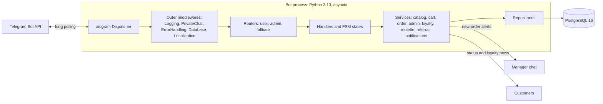
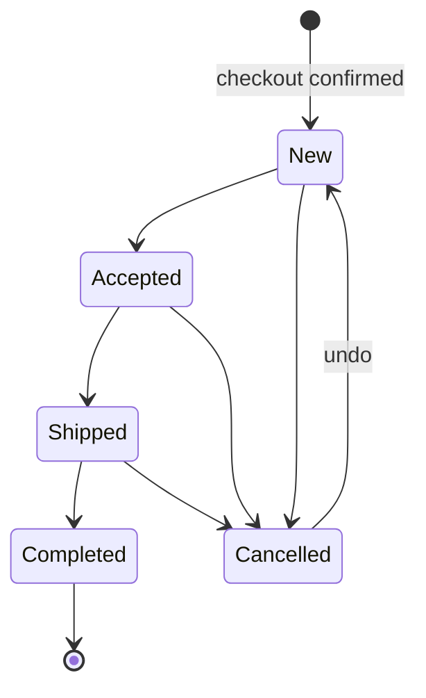
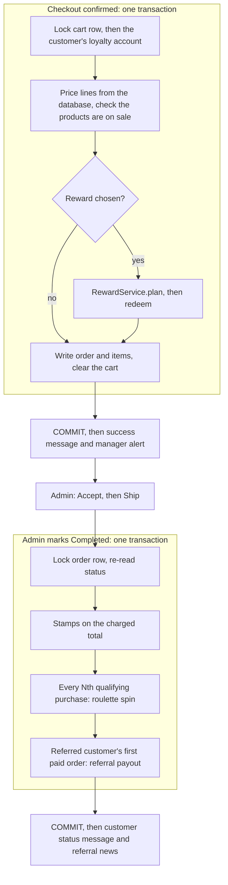

# Architecture

V-Shop is a single-process, asynchronous Telegram bot: aiogram 3 on asyncio, with
SQLAlchemy 2 (async) and asyncpg over PostgreSQL 16. This document describes the
layers, the request path, transaction handling, and how the order flow and the
loyalty subsystem fit together. The loyalty features have their own documents:
[Loyalty](loyalty.md), [Roulette](roulette.md) and [Referrals](referrals.md).

## Overview



```text
Telegram update
    → Middlewares (log → private chat → errors → DB session → i18n)
    → Routers (user | admin | fallback)
    → Handlers
    → Services
    → Repositories
    → PostgreSQL
```

Dependencies point inward. Handlers parse updates, drive FSM state and render
screens; business rules live in services; queries live in repositories. Handlers
receive the `session` from the database middleware and pass it to services — they
do not build queries themselves.

## Package map

| Package | Responsibility |
|---|---|
| `app/handlers/` | aiogram routers: parse updates, drive FSM, call services, render screens |
| `app/keyboards/` | reply / inline keyboard builders and the `CALLBACK_*` constants |
| `app/middlewares/` | cross-cutting: request log, private-chat gate, error handling, session lifecycle, localization, admin gate |
| `app/filters/` | `IsAdmin` / `IsNotAdmin` (`ADMIN_IDS` or an active emergency session), `LocalizedText` (menu buttons matched in every language) |
| `app/services/` | use cases: catalog, cart, order, admin façade (catalog, orders, users and customer lookup, manual stamp credits), broadcast, notifications, statistics, loyalty, roulette, rewards, referrals, emergency admin sessions and authentication |
| `app/repositories/` | CRUD and query helpers per aggregate; `visibility.py` holds the single "on sale" rule |
| `app/models/` | SQLAlchemy ORM models and domain enums |
| `app/states/` | FSM `StatesGroup` definitions (onboarding, checkout, admin wizards) |
| `app/locales/` | four JSON catalogs with identical key sets |
| `app/utils/` | validators, HTML escaping, i18n helpers, display helpers, locks, cache, Telegram UI helpers, password hashing |
| `app/errors/` | classify exceptions → safe localized user messages |
| `app/security/` | the one admin-access decision: `resolve_admin_grant` — `ADMIN_IDS` from settings, or an active break-glass session from the database |
| `app/database/` | engine and session factory (`hide_parameters=True`) |
| `app/config.py` | Pydantic Settings — every environment variable |
| `app/bot.py`, `app/main.py`, `app/lifecycle.py` | bot and dispatcher factories, process entry point, startup / shutdown hooks |
| `app/check_startup.py`, `app/verify_deployment.py`, `app/hash_emergency_password.py` | startup smoke check; read-only post-deploy report; the operator's password-hash tool |

## Middleware order

Registered as outer update middlewares in `app/middlewares/__init__.py`
(first = outermost). **The order is load-bearing, not cosmetic.**

1. **Logging** — timing / request log (`update_id`, kind, `user_id`, duration only;
   never message text or payloads)
2. **PrivateChat** — drops anything that is not a private chat
3. **Error handling** — catches handler failures, answers with safe localized text
4. **Database** — opens `AsyncSession`, commits on success, rolls back on error, closes
5. **Localization** — loads `db_user`, injects `i18n` / `language`

Why 2 sits where it does:

- **Ahead of Database**, so a group update never opens a session or starts a
  transaction.
- **Ahead of Error handling**, so a failure further down can never produce a
  reply *into* a group.

Error handling sits outside Database, so the session has already rolled back
before the user sees the error message. Dispatcher-level `errors` handlers act as
a final safety net.

## Group-chat isolation

The bot processes user and admin interactions **only in private chats**. Manager
and review groups are notification destinations, never interfaces.

Enforced centrally, in three places that each close a different route:

| Layer | What it stops |
|---|---|
| `PrivateChatMiddleware` (outer, position 2) | every message and callback from a group, supergroup or channel |
| `notify_user_of_error` | the error notifier answering into a group when aiogram handles an update itself |
| `UserRepository.list_telegram_ids()` | broadcasts reaching a chat recorded with a negative (group) ID |

Outbound notifications still go to `MANAGER_CHAT_ID`, and carry **no inline
keyboards** — a group must never be given buttons to press.

## Transactions

`DatabaseMiddleware` gives every update one database transaction: it commits when
the handler succeeds and rolls back on any exception, so services normally only
`flush()`. A handler commits earlier only where a Telegram side effect must
follow a durable write:

| Handler | Commits before |
|---|---|
| Checkout confirm (`OrderService.place_order_from_cart`) | the success message and the manager alert |
| Admin order status change | notifying the customer and any referral payout news |
| Stamp card claim | answering the tap |
| Roulette spin | the animation and the result |
| `/start` | the first reply, and telling a referrer that a friend joined |
| 👥 Invite a Friend | sending the screen with a newly created link |
| Broadcast confirm | the long Telegram fan-out |
| `/emergency_admin` password step | answering — the attempt and any new session are durable, and the user-row lock released, before the operator hears anything |
| 🪪 Loyalty credit confirm | answering the operator — the ledger row and its author row are committed inside `confirm_once`, so the account lock never spans a Telegram call |

The rule behind these: **never await Telegram while holding a loyalty lock** — or
any row lock. A refusal (a checkout step that cannot proceed, a refused claim, an
invalid status tap) ends its transaction before answering. Code that runs after a
commit only reads, without locks.

## Routing

```text
root
├── user router
│   ├── start           /start, onboarding, referral links
│   ├── emergency_admin /emergency_admin: password step, then the existing panel
│   ├── catalog, cart
│   ├── stamp_card      🪪 My Stamp Card
│   ├── roulette        🎰 Lucky Roulette
│   ├── invite          👥 Invite a Friend
│   ├── checkout        FSM (after the loyalty menus, so their buttons win over free-text steps)
│   ├── info            information pages, language and city, reviews
│   └── admin_guard     /admin access denied for non-admins
├── admin router        (IsAdmin filter + AdminOnlyMiddleware: ADMIN_IDS or an active emergency session)
│   ├── wizard_guard    blocks menu jumps while a wizard is active
│   ├── products        add-product wizard
│   ├── product_manage  list, view, edit, enable/disable, delete
│   ├── categories
│   ├── subcategories   brands
│   ├── orders
│   ├── broadcast
│   ├── statistics
│   ├── loyalty         🪪 Loyalty: /admin_adjust_stamps, the stamp-credit wizard
│   ├── settings
│   └── panel           /admin
└── fallback            answers buttons nothing above handled; admin buttons excluded
```

## Main user flows

### Onboarding

`/start` → ensure the user row (with an empty cart and loyalty account) → welcome
roulette spin → optional referral attribution → choose language → choose city →
main menu: 🛍 Catalog · 🛒 Cart · 🪪 My Stamp Card · 🎰 Lucky Roulette · 👥 Invite a
Friend · ℹ Information.

### Catalog → cart

Categories → brands → product cards → add to cart → cart (± quantity, remove) →
checkout. Only products that are on sale (product, category and brand active) are
shown and can be ordered.

### Checkout (FSM)

Name → delivery method (city-gated: Berlin `pickup` / `courier`, other cities
`postal` / `service`) → address → preferred time → contact (shared contact, typed
phone, or Telegram) → payment method (`cash` / `card`) → **reward** (only for a
customer holding a reward that fits the cart) → summary → confirm.

Confirming runs inside the customer's process-local `keyed_lock` and the FSM
`submitted` flag, then `OrderService.place_order_from_cart` locks the cart row
(`SELECT … FOR UPDATE`) and the customer's loyalty account, prices the lines from
the database, re-plans any chosen reward, writes the order and clears the cart —
one transaction, committed before the manager alert. A second tap on Confirm is
answered "already submitted".

### Order lifecycle



Transitions are defined once, in `ALLOWED_TRANSITIONS` (`app/utils/order_status.py`),
and enforced by the service — not only by the keyboard. `Completed` is terminal.
`AdminOrderService.change_order_status` locks the order row and re-reads its
status, so a stale screen cannot cancel an order someone has just completed, and
two admins tapping at once move it once.

### Order and reward flow

The loyalty programme hangs off the two order events that already exist — no
second pipeline:



| Event | What happens, in the same transaction |
|---|---|
| Checkout confirmed (`OrderService.place_order_from_cart`) | the chosen reward is re-planned under lock; the order is written with a €0 unit (free bottle) or a lowered total (discount); the reward is bound to it |
| Order completed (`AdminOrderService.change_order_status`) | stamps (`StampCardService.award_for_order`), the milestone spin (`SpinEntitlementService.grant_for_completed_order`), a first order's referral payout (`ReferralProgramService.settle_for_completed_order`) |

## Customer order status notifications

When an admin changes an order's status, the customer is messaged in the language
stored on their user row — not the admin's.

- Notified on `Accepted`, `Shipped`, `Completed`, `Cancelled`.
- **Not** notified on `Cancelled → New` (the undo), and never when a status is
  re-applied unchanged.
- Delivery is best-effort and isolated: `notify_status_change` never raises, so a
  blocked user or a Telegram outage **cannot roll back the status change**. A
  blocked or deleted user logs at INFO; anything unexpected logs at ERROR.

Implementation: `app/services/customer_notification.py`.

## Loyalty subsystem

The stamp card, the roulette and the referral programme share one persistence
layer; the tables are described in [database-schema.md](database-schema.md#loyalty).

| Service | Owns | Details |
|---|---|---|
| `LoyaltyService` (`app/services/loyalty.py`) | accounts, the stamp ledger, the account lock | [Loyalty](loyalty.md#the-stamp-ledger) |
| `StampCardService` (`app/services/stamp_card.py`) | stamp rules, the qualifying-purchase rule, the card, claims | [Loyalty](loyalty.md) |
| `RewardService` (`app/services/reward.py`) | reward options, planning and redemption at checkout | [Loyalty](loyalty.md#redeeming-rewards-at-checkout) |
| `SpinEntitlementService` (`app/services/spin_entitlement.py`) | which activity earns a spin | [Roulette](roulette.md#where-spins-come-from) |
| `RouletteEngine`, `RouletteService` (`app/services/roulette_engine.py`, `app/services/roulette.py`) | the weighted draw; spending a grant on a prize | [Roulette](roulette.md) |
| `ReferralService`, `ReferralProgramService` (`app/services/referral.py`, `app/services/referral_program.py`) | codes, links, attribution, qualification, payout | [Referrals](referrals.md) |
| `ReferralNotificationService` (`app/services/referral_notification.py`) | referral news after the commit | [Referrals](referrals.md#notifications) |
| `LoyaltyActivationService` (`app/services/loyalty_activation.py`) | idempotent startup backfill of accounts and welcome spins | [Roulette](roulette.md#where-spins-come-from) |

Three rules hold it together:

1. **Lock the customer's account first.** Every mutation starts with
   `LoyaltyService.lock_account` — `SELECT … FOR UPDATE` on the customer's
   `loyalty_accounts` row, refreshing the ORM instance — which serialises one
   customer's loyalty operations inside PostgreSQL. A spin grant, which only
   inserts a row its unique index keys, needs no lock.
2. **Idempotency comes from the schema.** Each earning event is tied to its
   source row (order, referral, spin, reward) by a unique constraint. Replaying
   it returns the original row with `created=False` instead of booking it twice.
3. **Validate before writing; never commit.** A refused operation leaves nothing
   behind, and the caller's transaction decides when the work becomes durable.

Refusals a customer can cause — `InsufficientStampsError`, `StaleCardError`,
the `Reward*Error`s, `InvalidPrizeError`, `SelfReferralError`,
`ReferralLoopError` — derive from `LoyaltyError` (a `ValueError`), so a caller
can answer them and still let a plain `ValueError`, a caller bug, surface. A
broken ledger invariant raises `LedgerInvariantError`, which is never a
customer refusal. The services reach the database only through repositories.

## Loyalty transactions and concurrency

Every loyalty operation below is one database transaction at PostgreSQL's
default isolation level, READ COMMITTED. Correctness comes from row locks and
unique constraints, not from the isolation level: every decision is made on
rows read under a lock (`SELECT … FOR UPDATE`, the ORM instance refreshed) or
is enforced by a constraint, and once a lock is granted each statement sees
what its previous holder committed. REPEATABLE READ or SERIALIZABLE would turn
those waits into serialization failures that nothing retries — don't raise the
level without adding retries.

| Operation | Transaction (committed by) | Locks, in order | Idempotency key — unique constraint | A replay or a racing duplicate | On failure |
|---|---|---|---|---|---|
| Purchase stamps | The admin's status change to Completed (`set_order_status`); the handler commits before any message | order row → customer's account | `loyalty_transactions.order_id` | Status already Completed: `changed = False`, nothing booked or sent | Status, stamps, spin and referral payout roll back together |
| Nth-purchase spin | The same, right after the stamps | account (held) | `roulette_spin_grants.order_id` | Numbered from the ledger's purchase rows under the account lock, so orders completing together get distinct numbers | As above |
| Referral stamps, both sides | The same (`settle_for_completed_order`) | referred customer's account (held since the stamp award) → referral row → referrer's account | `referrals.qualifying_order_id`; `loyalty_transactions (referral_id, user_id)` | Referral already `qualified`: nothing more | As above |
| Referral spin | The same (`grant_for_referral`) | none — the unique index decides | `roulette_spin_grants (referral_id, user_id)` | Insert-or-find in a savepoint | As above |
| Welcome spin | `/start`, committed before any reply; the start-up backfill, one statement before polling starts | none — the unique index decides | partial unique `roulette_spin_grants (user_id)` where `reason = 'initial_promo'` | `/start`: insert-or-find in a savepoint; backfill: `ON CONFLICT DO NOTHING` in `user_id` order | `/start` rolls back and the next one grants it; a failed backfill is logged and the bot starts |
| Referral attribution | `/start ref_<code>`, committed before any reply | referred customer's account → attribution advisory lock | `referrals.referred_user_id` | Insert-or-find in a savepoint: `ALREADY_REFERRED` | Nothing written; onboarding carries on |
| Spending a spin | Roulette tap, inside the customer's `keyed_lock`; committed before the animation | account → grant row | `roulette_spins.grant_id` — the callback names the grant | Grant already spent: its saved result is replayed (`created = False`) | All rolled back; the grant stays available |
| Prize: stamps | The spin's transaction | account (held) | `loyalty_transactions.spin_id` | The spin's replay | As the spin |
| Prize: discount or free-bottle reward | The spin's transaction | account (held) | `user_rewards.spin_id` | The spin's replay | As the spin |
| Claiming a free bottle | Stamp-card tap, inside the customer's `keyed_lock`; committed before the answer | account | the card version (its latest ledger id); `loyalty_transactions.reward_id` | The same card again: `AlreadyClaimedError`; newer activity: `StaleCardError` | Refused before any write; stamps intact |
| Redeeming a reward at checkout | Confirm, inside the customer's `keyed_lock` and FSM `submitted`; committed before the manager alert | cart row → account → reward row | `user_rewards.order_id` (one reward per order); `available → used` under the reward's lock | A second confirm: `already_submitted`; a reward used meanwhile is refused and the summary shown again | No order; the reward stays available |

**Balances cannot go negative.** The stamp balance and each ledger row's
`balance_after` carry `CHECK (… >= 0)`; `LoyaltyService` refuses an overdraw
before writing, and every debit runs under the account lock, so two claims never
both see enough stamps. The spin balance is not a counter but the number of
unspent grants: spending one sets its `consumed_at` under its row lock, so the
balance can neither drop below zero nor spend a grant twice.

**No automatic retries.** At READ COMMITTED with these locks PostgreSQL raises
no serialization failures, and the lock order below rules out deadlocks. An
operation that fails rolls back whole — validation runs before the first write,
and a savepoint only absorbs an insert a concurrent transaction won — so the
customer's next tap, Telegram redelivering the update or a restart simply runs
it again, and its idempotency key makes that safe even when the first attempt
did commit.

**Lock order.** Every path takes its locks in this order, so no two
transactions wait on each other in a cycle:

1. the process-local `keyed_lock` for the customer (checkout, roulette, claim);
2. the customer's cart row (placing an order);
3. the order row (a status change);
4. the customer's own loyalty account — in a completion, the order's customer,
   whose account the stamp award takes before any payout;
5. the referral row (a payout) — only ever after the referred customer's
   account: a payout needs a Completed, post-launch order charged above €0,
   exactly the order the stamp award has already locked that account for;
6. the referrer's account, then up the chain. Attribution refuses loops
   anywhere up a chain, so payouts running at once always wait towards the
   root of their chain;
7. the operation's own rows: the grant, the reward;
8. the attribution advisory lock (`/start ref_<code>` only), last.

Placing an order and attributing a referral both take the customer's account
lock: an order being placed either commits before attribution asks whether the
customer has ever ordered, or waits until the attribution is decided — a
referral never lands on top of a first order in flight.

**Telegram is never awaited under a loyalty lock.** Every handler commits before
it talks to Telegram (see [Transactions](#transactions)). What runs after a
commit only reads, without locks — referral news takes the referrer's link from
`existing_invitation`, which never locks or creates. A slow Telegram never stalls
another customer's attribution, or a payout waiting on the same account.

`tests/test_loyalty_postgres.py` races each operation in real transactions,
`tests/test_loyalty_journeys_postgres.py` races whole updates through the
production dispatcher, and `tests/test_loyalty_concurrency.py` races the
combinations — a first order against an attribution, a referral chain paying
out at once, one customer under every kind of load — checks the books with
`loyalty_health` afterwards, and fails if any Bot API call is made while a
loyalty lock is held. All three run when `VSHOP_TEST_POSTGRES_URL` is set; on
every run, `tests/test_loyalty_scenarios.py` and `tests/test_loyalty_guards.py`
check that each path requests its locks before its first write.

## Statistics

`StatisticsService` assembles the admin dashboard from **nine aggregate queries**
whose count does not grow with order history — no order rows are loaded into the
process. Month boundaries are cut in `APP_TIMEZONE` (default `Europe/Berlin`),
so an order placed at 00:30 local on the 1st belongs to the new month even though
it is still the previous month in UTC.

Product rankings count **distinct completed orders** containing a product, not
units sold, and cover only products that are on sale. See
[admin-guide.md](admin-guide.md#statistics).

## Reviews group

Customers reach the private reviews group through an invite link the bot resolves
on demand (or `REVIEW_INVITE_LINK` verbatim). The group's chat ID never appears
in anything sent to a user. Links are cached in-process for an hour.

## Admin services

`AdminService` is a backwards-compatible façade over:

- `AdminCatalogService` — categories, brands and products
- `AdminOrderService` — order queries and status changes (including the
  loyalty booking on completion)
- `AdminUserService` — broadcast recipient IDs, and finding one customer by
  Telegram id or `@username` (`resolve_customer`)
- `AdminLoyaltyService` — manual stamp credits through the ledger, with an
  author row per credit (`credit_stamps`)

The status-change handler builds `AdminService(session, settings=settings)`, so
completion applies the configured loyalty rules; `tests/test_stamp_card.py` pins
that. New code uses the focused services.

## Emergency access and manual stamp credits

Two administrative capabilities sit on the layers above without adding a second
panel or a second balance.

**Who may use the admin router** is decided by one function,
`resolve_admin_grant` (`app/security/admin.py`): a Telegram id in `ADMIN_IDS` is
granted from settings alone; anyone else only by an `admin_access_sessions` row
that is neither revoked nor expired, read from the database on every update.
The admin router's `IsAdmin` filter makes that decision once and hands it on as
`admin_grant`; `AdminOnlyMiddleware` reuses it; the user router's `IsNotAdmin`
negates it for the `/admin` denial. No handler checks access itself.

**How a session comes to exist**: `/emergency_admin` (user router) asks for the
password, deletes the message that carried it and hands it to
`EmergencyAdminAuthService`, which checks it against `EMERGENCY_ADMIN_PASSWORD_HASH`
(scrypt, constant-time, in a worker thread), records the attempt in
`admin_access_attempts`, locks the account out after
`EMERGENCY_ADMIN_MAX_FAILED_ATTEMPTS` failures for `EMERGENCY_ADMIN_LOCKOUT_MINUTES`,
and on success opens one session lasting `EMERGENCY_ADMIN_SESSION_TTL_MINUTES`
through `AdminAccessService`, revoking the user's earlier one. Every denial is
answered with the non-admin's "Access denied"; with the hash unset the command
is silent. A session never changes `ADMIN_IDS`, expires on its own, and is a
row that stays on record — the audit trail of who held admin rights and when.

**How stamps are credited by hand**: the 🪪 Loyalty wizard (admin router) names
the customer through `AdminUserService.resolve_customer` — a Telegram id
exactly, or a `@username` matched against the stored handle and refused when
missing or shared — shows their card, takes a whole number up to
`LOYALTY_ADMIN_MAX_STAMP_ADJUSTMENT`, and confirms with a button that carries
only a fresh operation id. The tap runs `AdminLoyaltyService.credit_stamps`
inside `confirm_once`: it re-resolves the customer by id, locks the account,
returns the credit already booked under that operation id if there is one, or
writes one `adjustment` ledger row through `LoyaltyService.adjust` and one
`loyalty_stamp_adjustments` author row (operator, authority, session, operation
id) in the same transaction, committed before the operator is answered. A credit
issues no reward and counts no purchase — a full card is claimed by the customer
exactly as after a purchase — and sends nothing to the customer, the manager chat
or the admins. Details: [Security](security.md), [Loyalty](loyalty.md#the-stamp-ledger),
[Admin guide](admin-guide.md#loyalty).

## Localization

- Files: `app/locales/{en,ru,de,uk}.json` — four languages, identical key sets
- Keys flattened to dotted paths (`menu.catalog`)
- `LocalizationService.t(key, **kwargs)` formats strings; the key is
  positional-only, so a placeholder may be named anything, `{language}` included
- `LocalizationService.plural(key, count)` picks the CLDR plural form (Russian
  and Ukrainian: one / few / many; English and German: one / other)
- Menu buttons matched via `LocalizedText` against all language variants
- Product names/descriptions are per-language **columns**, resolved by
  `app/utils/product_display.py` — distinct from the locale catalogs

### Localization policy

Every **customer-facing** string goes through `i18n.t()`. Enforced by
`tests/test_localization_audit.py`, which fails the build if a referenced key is
missing, if the catalogs drift apart, if a handler/keyboard passes a literal
string to Telegram, or if handlers, keyboards, services, error paths or display
helpers write a sentence in code (`NOT_SHOWN` lists the few literals no customer
sees). `tests/test_localization.py` renders every template in every language with
its placeholders filled.

`tests/test_localization_quality.py` keeps each language one voice. Customers
are addressed formally everywhere — German "Sie" — and the one informal text is
the message a customer shares with a friend (`invite.share_text*`). Quotes are
the language's own (“…”, „…“, «…»); German sets a no-break space before `%`, the
others none; every key carries the same emoji in every language; the loyalty
features use one word per concept (stamp, reward, spin, free bottle) in each
language; plural families are complete; money in loyalty texts comes from
`format_amount`. An ordinal that agrees with its noun — the stamp card's "11th
bottle" — is rendered by `feminine_accusative_ordinal` (`app/utils/i18n.py`), so
any configured card size reads right. `tests/test_loyalty_languages.py` walks the
whole customer journey in each language and checks that every screen fits a
phone.

**Documented exception — the manager/ops order alert.**
`app/services/notification.py` builds its field labels in English on purpose, and
`app/utils/labels.py` provides `city_label_en` / `delivery_label_en` for it. The
alert's primary destination is `MANAGER_CHAT_ID`, a single shared chat delivered
to every member at once, so there is no per-recipient language to resolve; a
fixed format also lets staff parse alerts at speed. Both modules carry an
`INTENTIONALLY NOT LOCALIZED` marker, and the audit test asserts that marker is
present. Customer-facing city/delivery labels use the localized
`city_label()` / `delivery_label()` in the same module.

## Concurrency & caching

- Process-local `keyed_lock` for confirm actions (checkout, stamp claim, roulette,
  broadcast, product create/edit via `confirm_once`)
- Loyalty: row locks, unique constraints and one lock order — see
  [Loyalty transactions and concurrency](#loyalty-transactions-and-concurrency)
- Category list TTL cache (`app/utils/cache.py`, 60 s), invalidated on every
  category mutation
- FSM: `MemoryStorage` (single process)

## Error handling

Exceptions are classified (`telegram` / `database` / `network` / `unexpected`) in
`app/errors/classify.py`. Users only see localized generic messages — never stack
traces or raw database errors; the details stay in the log.

## Startup and shutdown

`app/main.py` builds the bot (HTML parse mode by default) and the dispatcher
(`MemoryStorage`), then starts long polling. `on_startup` (`app/lifecycle.py`)
initializes the engine, checks connectivity, logs the database identity, runs the
idempotent loyalty activation, deletes any webhook dropping pending updates, and
calls `getMe`. The full sequence and restart behaviour are in
[Deployment](deployment.md#health-expectations).

## Testing

Unit, integration, end-to-end (real updates through the production dispatcher),
PostgreSQL concurrency, migration, security, localization and documentation
tests — see [Testing](testing.md).

## Design decisions and trade-offs

| Decision | Why | Cost |
|---|---|---|
| Long polling, not webhooks | no inbound port, TLS endpoint or webhook secret to operate | one process per bot token |
| `MemoryStorage` FSM, process-local locks and cache | simple, fast, no extra infrastructure | a single bot instance; FSM state is lost on restart |
| READ COMMITTED + row locks + unique constraints | no serialization failures to retry; every operation idempotent | the lock order must be respected by every new path (tests check it) |
| Loyalty booked inside the order's own transactions | status and rewards can never disagree; no background jobs | the admin's status tap does a little more work |
| Stamp ledger as the source of truth, balance as a cache | every balance is explainable and auditable | two writes per movement |
| Server-side draw (`secrets.randbelow`), prizes in code, weights in configuration | odds are exact and cannot be influenced by a client | changing a prize needs a code change |
| Expand/contract migrations; upgrades never drop | a deploy can never destroy data | legacy columns linger until a contract migration |
| External, required database volume | a deploy cannot attach to an empty database by accident | one extra setup step per deployment |
| Enums stored by value as `VARCHAR` | adding a value needs no migration | the database does not constrain plain enum columns |
| English manager alerts | one shared chat, one parseable format | not localized |
| Documentation facts pinned by tests | docs cannot silently drift from code | docs change together with the code |
| Emergency sessions as database rows, never as `ADMIN_IDS` entries | a break-glass grant is time-boxed, revocable and on record; the permanent allow-list is never edited by the bot | one indexed query per update from a user outside `ADMIN_IDS` that reaches the admin router |
| Manual credits through the ledger with an author row | the stamps take the same path and locks as every other movement, and every credit names who made it and under which authority | an operation id per confirmation screen, so a repeat is the same credit |
