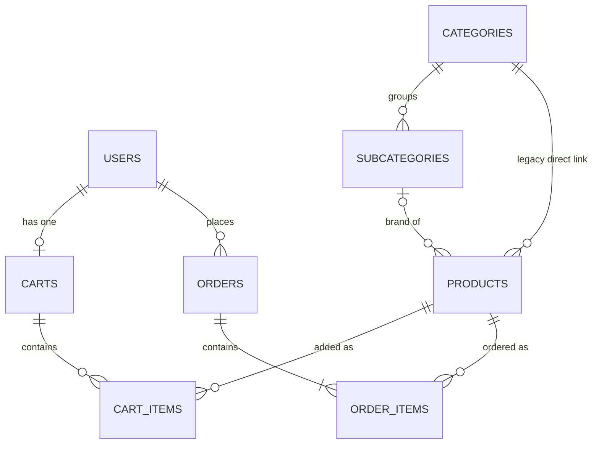
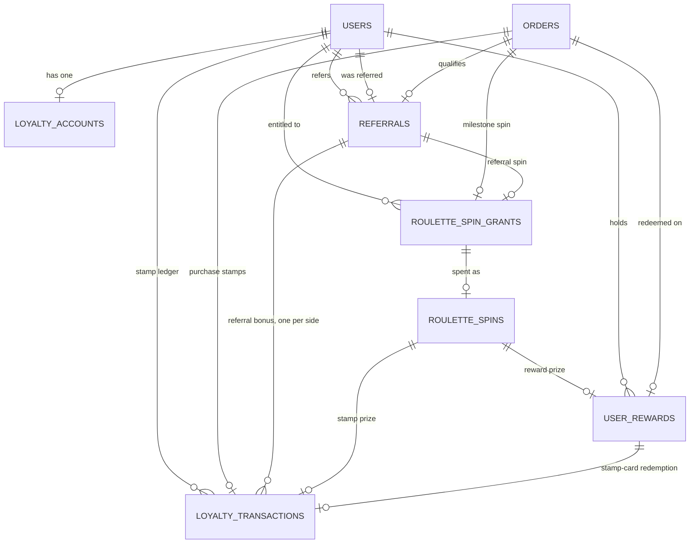

# Database schema

PostgreSQL schema is managed by Alembic.

| Revision | Purpose |
|---|---|
| `a9b389353e68` | Initial tables |
| `b2c4d5e6f7a8` | Performance indexes |
| `c7e1f4a9d3b6` | Catalog hierarchy: `subcategories`, localized names, `uk` columns |
| `d4f2a8c1b9e3` | `orders.payment_method` |
| `e5a3c7d21f04` | Statistics index on `order_items` |
| `f6b1d4e8a207` | Drop two indexes made redundant by composites |
| `3b9d6f2a8c14` | Loyalty foundation: accounts, stamp ledger, roulette, rewards, referrals |
| `8e4c1a7b2d95` | `orders.loyalty_eligible` — stamps only for orders placed after launch |
| `c5d2e8f1a6b3` | Reward redemption record: `user_rewards.discount_amount`, `redeemed_product_id` |

```bash
alembic upgrade head
alembic revision --autogenerate -m "describe change"
alembic downgrade -1
```

## Entity relationship

Core shop tables (the loyalty tables follow in [Loyalty](#loyalty)):



`categories → subcategories → products` is the current hierarchy; the direct
`categories → products` link is retained from the pre-hierarchy schema (see
below).

## Catalog hierarchy

`Category → Subcategory → Product`. Both levels carry four localized names
(`ru` / `en` / `de` / `uk`), `sort_order`, `is_active` and timestamps.

Two columns are **deliberately retained** from the pre-hierarchy schema so the
existing handlers keep working while the catalog UI is migrated:

| Legacy column | Superseded by | Status |
|---|---|---|
| `categories.name` | `categories.name_{ru,en,de,uk}` | Still written, kept in sync by `CategoryRepository` |
| `products.category_id` | `products.subcategory_id` | Still written; `subcategory_id` is nullable until product creation collects one |

A later **contract** migration drops both once the catalog and admin UI read the
hierarchy. Until then `alembic check` stays clean because the models still map
them.

## Tables

### `users`

| Column | Type | Notes |
|---|---|---|
| `id` | serial PK | Internal ID |
| `telegram_id` | bigint | Unique, indexed |
| `username` | varchar(255) | Nullable |
| `first_name` | varchar(255) | Nullable |
| `language` | varchar(8) | `ru` / `en` / `de` / `uk`, nullable until onboarding |
| `selected_city` | varchar(32) | `berlin` / `delivery`, nullable until onboarding |
| `last_seen` | timestamptz | Default `now()` |
| `created_at` | timestamptz | Default `now()` |

Indexes: `telegram_id`.

### `categories`

| Column | Type | Notes |
|---|---|---|
| `id` | serial PK | |
| `name` | varchar(255) | **Legacy** single-language name; kept in sync on write |
| `name_ru` / `name_en` / `name_de` / `name_uk` | varchar(255) | Localized names |
| `sort_order` | int | Default `0`; lower sorts first |
| `is_active` | boolean | Default `true` |
| `created_at` / `updated_at` | timestamptz | `updated_at` maintained on write |

Indexes: `sort_order`, `name`, `is_active`.

### `subcategories`

Brand / product group inside a category.

| Column | Type | Notes |
|---|---|---|
| `id` | serial PK | |
| `category_id` | int FK → categories | `ON DELETE RESTRICT` |
| `name_ru` / `name_en` / `name_de` / `name_uk` | varchar(255) | Localized names |
| `sort_order` | int | Default `0` |
| `is_active` | boolean | Default `true` |
| `created_at` / `updated_at` | timestamptz | |

Indexes: `category_id`, composite `(category_id, is_active)`, `sort_order`.

### `products`

| Column | Type | Notes |
|---|---|---|
| `id` | serial PK | |
| `subcategory_id` | int FK → subcategories, nullable | `ON DELETE RESTRICT`; the hierarchy link |
| `category_id` | int FK → categories | **Legacy** direct link, `ON DELETE RESTRICT` |
| `name_ru` / `name_en` / `name_de` / `name_uk` | varchar(255) | Localized names |
| `description_ru` / `description_en` / `description_de` / `description_uk` | text | Localized descriptions |
| `updated_at` | timestamptz | Maintained on write |
| `flavor` | varchar(255) | |
| `volume` | varchar(64) | |
| `nicotine_strength` | varchar(64) | |
| `price` | numeric(10,2) | |
| `image_file_id` | varchar(255) | Telegram file_id, nullable |
| `is_active` | boolean | Default `true` |
| `created_at` | timestamptz | |

Indexes: `category_id`, `is_active`, composite `(category_id, is_active)`, composite `(subcategory_id, is_active)`. There is no single-column index on
`subcategory_id`: the composite leads with it.

### `carts`

| Column | Type | Notes |
|---|---|---|
| `id` | serial PK | |
| `user_id` | int FK → users | Unique; `ON DELETE CASCADE` |

Indexes: `user_id`.

### `cart_items`

| Column | Type | Notes |
|---|---|---|
| `id` | serial PK | |
| `cart_id` | int FK → carts | `ON DELETE CASCADE` |
| `product_id` | int FK → products | `ON DELETE CASCADE` |
| `quantity` | int | `> 0`; default `1` |

Unique `(cart_id, product_id)`.

Indexes: `cart_id`, `product_id`.

### `orders`

| Column | Type | Notes |
|---|---|---|
| `id` | serial PK | |
| `user_id` | int FK → users | `ON DELETE RESTRICT` |
| `customer_name` | varchar(255) | |
| `city` | varchar(32) | Snapshot of city choice |
| `delivery_type` | varchar(64) | `pickup` / `courier` / `postal` / `service` |
| `address` | text | |
| `preferred_time` | varchar(255) | Nullable |
| `phone` | varchar(64) | Nullable (Telegram contact path) |
| `total_price` | numeric(10,2) | `>= 0` |
| `payment_method` | varchar(32) | `cash` / `card`. Nullable — orders placed before this column existed keep `NULL` |
| `status` | varchar(32) | `New` / `Accepted` / `Shipped` / `Completed` / `Cancelled` |
| `loyalty_eligible` | boolean | `true` for every order the app places; server default `false`, so orders that existed when the loyalty programme launched never earn stamps |
| `created_at` | timestamptz | |

Indexes: `user_id`, composite `(status, created_at)`. There is no single-column
index on `status`: the composite leads with it and serves those lookups,
including `count(*) WHERE status = ?` as an index-only scan.

### `order_items`

| Column | Type | Notes |
|---|---|---|
| `id` | serial PK | |
| `order_id` | int FK → orders | `ON DELETE CASCADE` |
| `product_id` | int FK → products | `ON DELETE RESTRICT` (blocks product delete if used) |
| `quantity` | int | `> 0` |
| `price` | numeric(10,2) | Unit price snapshot; `>= 0` |

Indexes: `order_id`, composite `(product_id, order_id)`.

## Loyalty

Persistence for the stamp card, the roulette and the referral programme
(`3b9d6f2a8c14`). Six tables; every foreign key is `ON DELETE RESTRICT`, so
loyalty history is never cascade-deleted.



Two rules hold the design together:

- **The ledger is the source of truth.** `loyalty_accounts.stamp_balance` is a
  cache written in the same flush as each `loyalty_transactions` row, and every
  row records `balance_after`. Both are CHECKed non-negative, so any balance can
  be explained row by row.
- **Idempotency is structural.** Every earning or spending event references the
  row that caused it, and a unique constraint on that reference means it can be
  booked at most once: one purchase row per order, one referral row per referral
  and side, one row per spin, one per redeemed reward; one welcome spin per
  customer, one milestone spin per order, one spin per grant, one reward per order.
- **Ownership is checked by the database.** `roulette_spins`, `user_rewards` and
  `loyalty_transactions` reference their grant, spin or reward by
  `(id, user_id)`, so a row can never point at another customer's entitlement.
  References to `orders` and `referrals` are ownership-checked by the services —
  enforcing them here would need new constraints on the existing `orders` table.

Every mutation of a customer's loyalty state locks that customer's
`loyalty_accounts` row first (`SELECT … FOR UPDATE`); see
`app/services/loyalty.py`.

### `loyalty_accounts`

| Column | Type | Notes |
|---|---|---|
| `id` | serial PK | |
| `user_id` | int FK → users | Unique; `ON DELETE RESTRICT` |
| `stamp_balance` | int | `>= 0`; cached ledger total |
| `qualifying_purchase_count` | int | `>= 0`; completed paid orders booked — drives the every-Nth-purchase spin |
| `referral_code` | varchar(32) | Nullable, unique; random, assigned on first use |
| `created_at` / `updated_at` | timestamptz | |

Indexes: unique `user_id`; unique constraint on `referral_code`.

### `loyalty_transactions`

The stamp ledger. Append-only.

| Column | Type | Notes |
|---|---|---|
| `id` | serial PK | |
| `user_id` | int FK → users | |
| `kind` | varchar(32) | `purchase` / `referral` / `roulette` / `redemption` / `adjustment` |
| `amount` | int | Signed: `purchase` ≥ 0 (an order below the threshold books 0), `referral` and `roulette` > 0, `redemption` < 0, `adjustment` ≠ 0 |
| `balance_after` | int | `>= 0`; running balance after this row |
| `order_id` | int FK → orders | Set only for `purchase`; unique |
| `referral_id` | int FK → referrals | Set only for `referral`; unique together with `user_id` |
| `spin_id` | int FK → roulette_spins | Set only for `roulette`; unique |
| `reward_id` | int FK → user_rewards | Set only for `redemption`; unique |
| `note` | varchar(255) | Required for `adjustment` |
| `created_at` | timestamptz | |

Indexes: composite `(user_id, id)` — a customer's history, newest first; the four unique source references above.

### `roulette_spin_grants`

A spin a customer is entitled to; available while `consumed_at` is NULL.

| Column | Type | Notes |
|---|---|---|
| `id` | serial PK | |
| `user_id` | int FK → users | |
| `reason` | varchar(32) | `initial_promo` / `purchase_milestone` / `referral` |
| `order_id` | int FK → orders | Set only for `purchase_milestone`; unique |
| `referral_id` | int FK → referrals | Set only for `referral`; unique together with `user_id` |
| `consumed_at` | timestamptz | NULL until spent |
| `created_at` | timestamptz | When granted |

Indexes: composite `(user_id, consumed_at)`; partial unique `user_id` where `reason = 'initial_promo'` — one welcome spin per customer.

### `roulette_spins`

Permanent spin history, with a snapshot of the prize so later configuration
changes never rewrite it.

| Column | Type | Notes |
|---|---|---|
| `id` | serial PK | |
| `user_id` | int FK → users | |
| `grant_id` | int FK → roulette_spin_grants | Unique — a grant is spent once, and only by its owner (`(grant_id, user_id)` references `(id, user_id)`) |
| `prize_code` | varchar(32) | Prize id at the time of the spin |
| `prize_type` | varchar(32) | `stamps` / `discount_percent` / `free_bottle` |
| `prize_value` | int | `> 0` |
| `created_at` | timestamptz | |

Indexes: `user_id`.

### `user_rewards`

Discounts and free bottles held until the customer uses one at checkout. No
expiry. A reward used on an order that is later cancelled stays `used`.

| Column | Type | Notes |
|---|---|---|
| `id` | serial PK | |
| `user_id` | int FK → users | |
| `kind` | varchar(32) | `discount_percent` / `free_bottle` |
| `value` | int | Percent 1–100 for a discount; `1` for a free bottle |
| `max_item_price` | numeric(10,2) | Free bottle only: the most expensive product it covers, snapshotted when issued |
| `source` | varchar(32) | `stamp_card` / `roulette` |
| `status` | varchar(32) | `available` / `used` |
| `spin_id` | int FK → roulette_spins | Set only for `roulette` rewards; unique |
| `order_id` | int FK → orders | The order it was used on; unique — one reward per order |
| `used_at` | timestamptz | Set together with `order_id` |
| `discount_amount` | numeric(10,2) | The value taken off the order; set exactly when used, `>= 0` |
| `redeemed_product_id` | int FK → products | Free bottle only: the product made free (its €0 order line); set exactly when used. `ON DELETE RESTRICT` |
| `created_at` | timestamptz | |

Indexes: composite `(user_id, status)`; unique `spin_id`, unique `order_id`.

### `referrals`

Attributed as `pending` when a new customer arrives through a referral link;
`qualified` at that customer's first completed paid order.

| Column | Type | Notes |
|---|---|---|
| `id` | serial PK | |
| `referrer_user_id` | int FK → users | |
| `referred_user_id` | int FK → users | Unique — one referrer per customer, never changed |
| `status` | varchar(32) | `pending` / `qualified` |
| `qualifying_order_id` | int FK → orders | Set on qualification; unique |
| `qualified_at` | timestamptz | Set together with `qualifying_order_id` |
| `created_at` | timestamptz | When attributed |

CHECK: `referrer_user_id <> referred_user_id`.

Indexes: `referrer_user_id`; unique `referred_user_id`, unique `qualifying_order_id`.

### `loyalty_stamp_adjustments`

The author of a manual stamp credit (`AdminLoyaltyService.credit_stamps`,
`app/services/admin/loyalty.py`). The stamps themselves are the
`loyalty_transactions` row of kind `adjustment` this row points at; this row adds
who credited them, under which authority, and the operation id that makes a
repeated request the same credit.

| Column | Type | Notes |
|---|---|---|
| `id` | serial PK | |
| `transaction_id` | int FK → loyalty_transactions | Unique — one author per adjustment row |
| `user_id` | int FK → users | The customer credited; the ledger row's owner |
| `actor_user_id` | int FK → users | The operator; never the customer |
| `actor_kind` | varchar(32) | `configured` (in `ADMIN_IDS`) / `break_glass` |
| `access_session_id` | int FK → admin_access_sessions | Set exactly when `actor_kind` is `break_glass` |
| `operation_id` | varchar(36) | Canonical UUID chosen by the caller; unique — the idempotency key |
| `created_at` | timestamptz | |

CHECK: `(actor_kind = 'break_glass') = (access_session_id IS NOT NULL)`; `user_id <> actor_user_id`.

Indexes: composite `(user_id, id)` — a customer's manual credits, newest first; unique `transaction_id`, unique `operation_id`.

## Admin access

### `admin_access_sessions`

A temporary, revocable admin grant for one registered user — the persistence
behind break-glass access. A session is **active** while `revoked_at` is `NULL`
and `expires_at` is still in the future; both timestamps are written from the
service's clock (`AdminAccessService`, `app/services/admin_access.py`). Rows are
never deleted by the application: revocation is a timestamp, so the table is the
audit trail of who held temporary admin rights and when. It stores no credential
of any kind and adds nobody to `ADMIN_IDS`. `resolve_admin_grant`
(`app/security/admin.py`) reads it on every admin-router update from a user
outside `ADMIN_IDS`.

| Column | Type | Notes |
|---|---|---|
| `id` | serial PK | |
| `user_id` | int FK → users | `ON DELETE RESTRICT`; the operator must be a registered user |
| `auth_method` | varchar(32) | `break_glass` |
| `expires_at` | timestamptz | Set once; never extended — a re-authentication opens a new session and revokes the old one |
| `revoked_at` | timestamptz | Nullable; set once, never cleared |
| `created_at` | timestamptz | |

CHECK: `expires_at > created_at`; `revoked_at IS NULL OR revoked_at >= created_at`.

Indexes: composite `(user_id, expires_at)`, partial on `revoked_at IS NULL` — the active-session lookup.

### `admin_access_attempts`

One row per emergency authentication attempt (`EmergencyAdminAuthService`,
`app/services/emergency_admin.py`): who, by which method, with what outcome,
when. The credential offered is never stored. The `failed` rows of the last
`EMERGENCY_ADMIN_LOCKOUT_MINUTES` — after the user's last `succeeded` row —
decide whether the next attempt is checked at all; an attempt refused that way is
recorded as `locked_out`.

| Column | Type | Notes |
|---|---|---|
| `id` | serial PK | |
| `user_id` | int FK → users | `ON DELETE RESTRICT` |
| `auth_method` | varchar(32) | `break_glass` |
| `outcome` | varchar(32) | `succeeded` / `failed` / `locked_out` |
| `created_at` | timestamptz | Written from the service's clock |

Indexes: composite `(user_id, created_at)` — the lockout count.

## Status & enum values

Every enum is stored **by value** as a plain `VARCHAR` (`native_enum=False`, with
no `CHECK` constraint). That is why adding `Shipped`, `uk` and the payment
methods needed no migration — and why a value must be written exactly as listed.
The loyalty values additionally appear inside the tables' consistency CHECKs, so
a new value that needs its own source column requires a migration.

| Enum | Column | Values |
|---|---|---|
| Language | `users.language` | `ru`, `en`, `de`, `uk` |
| City | `users.selected_city` | `berlin`, `delivery` |
| Order status | `orders.status` | `New`, `Accepted`, `Shipped`, `Completed`, `Cancelled` |
| Payment method | `orders.payment_method` | `cash`, `card` — nullable, so orders placed before the column existed keep `NULL` |
| Ledger entry kind | `loyalty_transactions.kind` | `purchase`, `referral`, `roulette`, `redemption`, `adjustment` |
| Spin grant reason | `roulette_spin_grants.reason` | `initial_promo`, `purchase_milestone`, `referral` |
| Prize type | `roulette_spins.prize_type` | `stamps`, `discount_percent`, `free_bottle` |
| Reward kind | `user_rewards.kind` | `discount_percent`, `free_bottle` |
| Reward source | `user_rewards.source` | `stamp_card`, `roulette` |
| Admin access method | `admin_access_sessions.auth_method`, `admin_access_attempts.auth_method` | `break_glass` |
| Admin access attempt outcome | `admin_access_attempts.outcome` | `succeeded`, `failed`, `locked_out` |
| Admin access kind | `loyalty_stamp_adjustments.actor_kind` | `configured`, `break_glass` |
| Reward status | `user_rewards.status` | `available`, `used` |
| Referral status | `referrals.status` | `pending`, `qualified` |

### Order status transitions

Enforced in `app/utils/order_status.py`, not only in the keyboard: an admin
cannot skip a step by replaying a callback.

```text
New ──► Accepted ──► Shipped ──► Completed   (terminal)
 │          │           │
 └──────────┴───────────┴────► Cancelled ──► New   (undo)
```

- `Completed` is terminal — nothing moves out of it.
- `Cancelled → New` exists deliberately, so a mistaken cancellation can be undone.
- Every transition except `Cancelled → New` notifies the customer.

## Integrity rules (application + DB)

- Cannot delete a **category** that still has products or subcategories (`RESTRICT`).
- Cannot delete a **subcategory** that still has products (`RESTRICT`).
- Cannot delete a **product** referenced by `order_items` (`RESTRICT`) — order
  history stays readable forever.
- Cart lines cascade when a product is deleted (if not blocked by orders).
- Checkout clears `cart_items` after creating the order in the same transaction.
- A product is **on sale** only when the product, its category, and (if it has
  one) its subcategory are all active. The rule lives in one place,
  `app/repositories/visibility.py`, and is used by catalog browsing, the checkout
  guard, and the statistics rankings alike.
- Loyalty rows are never cascade-deleted: every loyalty foreign key is
  `RESTRICT`, and `users` / `orders` rows referenced by them cannot be deleted.
- A stamp balance can never go negative, and every ledger row carries exactly the
  source reference its `kind` requires — both enforced by CHECK constraints.

## Transactions and consistency

- **One transaction per Telegram update.** `DatabaseMiddleware` commits when the
  handler succeeds and rolls back on any exception. Handlers commit earlier only
  where a Telegram message must follow a durable write — placing an order, an
  admin status change, a stamp claim, a roulette spin, `/start`, the invite
  screen, a broadcast; see [Architecture](architecture.md#transactions).
- **READ COMMITTED plus locks.** PostgreSQL runs at its default isolation level.
  Loyalty correctness comes from row locks (`SELECT … FOR UPDATE`) taken in one
  global order and from the unique constraints listed above, not from a stricter
  level; see
  [Loyalty transactions and concurrency](architecture.md#loyalty-transactions-and-concurrency).
- **Rewards share the order's transaction.** Completing an order books its
  stamps, milestone spin and referral payout in the status change's own
  transaction; redeeming a reward happens in the transaction that writes the
  order. Status and rewards become durable together or not at all.
- **Money** is `numeric(10,2)` in the database and `Decimal` in Python; floats
  are refused.

## Auditability

Every loyalty balance and reward can be traced to the event that caused it:

| Question | Answered by |
|---|---|
| Why does a customer have N stamps? | `loyalty_transactions`: one row per movement, with its `kind`, signed `amount`, `balance_after` and source reference |
| Where did a spin come from? | `roulette_spin_grants.reason`, plus `order_id` or `referral_id` |
| What did a spin win? | `roulette_spins` stores a prize snapshot (`prize_code`, `prize_type`, `prize_value`), so later weight or catalogue changes never rewrite history |
| What was a reward worth, and what did it pay for? | `user_rewards.discount_amount`, `redeemed_product_id`, `order_id`, `used_at` |
| Who referred whom, and which order paid it out? | `referrals` — parties immutable, `qualifying_order_id` and `qualified_at` set once |

Loyalty rows are never cascade-deleted. `python -m app.verify_deployment`
recomputes the cached balances and purchase counts from the ledger and
cross-checks rewards, spins and referrals against the orders they name; every
counter must be `0` — see [Deployment](deployment.md#verifying-a-deploy).

## Migrations

Nine, linear and single-headed. See
[deployment.md](deployment.md#migrations) for what each one does and which
downgrades are data-safe. No `upgrade()` in this project drops a table, drops a
column, truncates, or deletes rows — enforced by `tests/test_migrations.py`.

## ORM location

Models live under `app/models/`. Repositories under `app/repositories/`.
