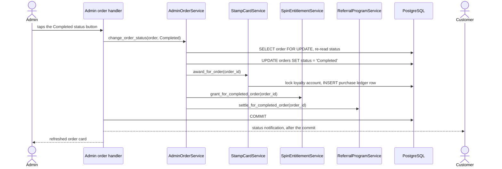
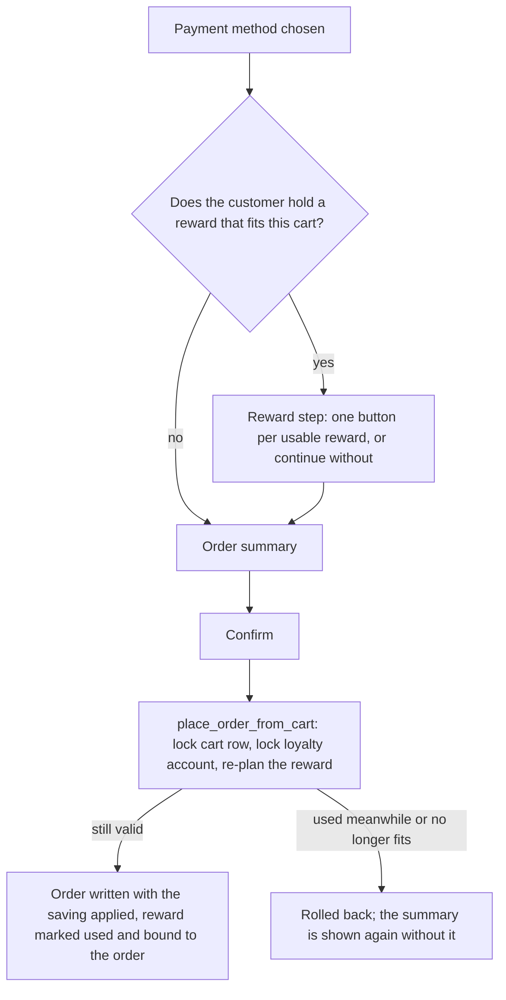

# Loyalty: Stamp Card and rewards

The loyalty programme has three customer-facing features — the 🪪 Stamp Card
(this document), the [🎰 Lucky Roulette](roulette.md) and the
[👥 referral programme](referrals.md) — on one persistence layer: a stamp ledger,
spin grants, rewards and referrals in PostgreSQL
([schema](database-schema.md#loyalty)). This document covers how stamps are
earned, how a full card becomes a free bottle, and how any reward is redeemed at
checkout.

## Rules at a glance

| Rule | Behaviour | Setting (default) |
|---|---|---|
| Earning | One stamp per whole multiple of the threshold in the order's **charged total** | `LOYALTY_STAMP_PURCHASE_THRESHOLD` (`20.00`) |
| When | Only when an admin marks the order **Completed** — never at placement | — |
| Which orders | Orders placed after the programme launched (`orders.loyalty_eligible`), charged more than €0 | — |
| Card size | A full card unlocks one free bottle | `LOYALTY_STAMPS_REQUIRED` (`10`) |
| Free bottle | Covers one product up to a price cap, snapshotted onto the reward when it is issued | `LOYALTY_FREE_BOTTLE_MAX_PRICE` (`20.00`) |
| Redemption | At checkout, chosen by the customer; one reward per order | — |
| Expiry | None — rewards never expire | — |
| Cancellation | A reward used on an order that is later cancelled stays used | — |

The settings are validated at startup (see [Configuration](configuration.md#loyalty-stamp-card));
changing one affects only what happens next — stamps and rewards already booked
never change.

## How stamps are earned

Stamps have exactly one trigger: the admin's status change to `Completed`.
`AdminOrderService.change_order_status` (`app/services/admin/orders.py`) locks
the order row, re-reads its status, and in the **same transaction** books the
stamps, the purchase-milestone roulette spin and any referral payout. The status
and everything it earned become durable together or not at all.

`StampCardService.award_for_order` (`app/services/stamp_card.py`) decides from
the order row alone. The single definition of a *qualifying purchase* is
`purchase_disqualification()` in the same module; the referral and roulette
services reuse it rather than restating it:

| Order | Outcome |
|---|---|
| Status not `Completed` | not a purchase |
| `loyalty_eligible` is false (placed before launch) | not a purchase |
| Charged total `<= 0` | not a purchase |
| Otherwise | a purchase: `floor(total_price / threshold)` stamps |

Worked examples with the default €20 threshold:

| Charged total | Stamps | Counts as a qualifying purchase (roulette milestone, referral) |
|---|---|---|
| €19.99 | 0 | yes — a 0-stamp purchase row is booked |
| €20.00 | 1 | yes |
| €39.99 | 1 | yes |
| €40.00 | 2 | yes |
| €0.00 (e.g. fully covered by a free bottle) | — | no |

The charged total is after any reward: a roulette discount has already been
taken off, and a free bottle is a €0 order line.

## The stamp ledger

`loyalty_transactions` is an append-only ledger; `loyalty_accounts.stamp_balance`
is a cache written in the same flush as each ledger row.

- Every row records `kind`, a signed `amount` and `balance_after`. Both balances
  carry `CHECK (… >= 0)`, and `LoyaltyService` refuses an overdraw before it
  writes, so a balance can never go negative.
- Every row points at its source: a purchase at its order, a referral bonus at
  its referral (per side), a roulette prize at its spin, a redemption at the
  reward it issued. A unique constraint on each reference makes the source
  bookable at most once — a replayed completion finds its row and returns it with
  `created=False`.
- Any balance can be explained row by row. `python -m app.verify_deployment`
  cross-checks the cached balances and purchase counts against the ledger (see
  [Auditability](#auditability)).

The ledger also supports signed `adjustment` rows with a mandatory note
(`LoyaltyService.adjust`). **No admin screen exposes them**; they exist for the
service layer and tests.

## The 🪪 My Stamp Card screen

`app/handlers/user/stamp_card.py` renders `StampCardService.card` through
`app/utils/stamp_card_display.py`; every figure is a property of the backend's
`StampCard`, so the screen computes nothing. It shows, in reading order on a
phone:

1. a progress bar towards `LOYALTY_STAMPS_REQUIRED`;
2. the promo ("get your 11th bottle free" for a 10-stamp card — the ordinal is
   inflected correctly in all four languages);
3. what to do next: the stamps still needed, or — on a full card — the button to
   tap;
4. extra stamps and free bottles already saved;
5. how stamps are earned, with the threshold in the reader's money format.

Opening or refreshing the card is read-only.

### Claiming a free bottle

On a full card the backend enables 🎁 Claim Free Bottle. The callback carries
only the card's **version** — the id of the customer's latest ledger row — so one
rendered card can be claimed once:

| Situation | Answer |
|---|---|
| Card still current, enough stamps | exactly `LOYALTY_STAMPS_REQUIRED` stamps are debited (a `redemption` row) and a `free_bottle` reward is issued with the current price cap |
| The same card tapped again | "already claimed" (`AlreadyClaimedError`), nothing written |
| The balance changed since the card was drawn | the card is redrawn (`StaleCardError`), nothing written |
| Not enough stamps | refused before any write (`InsufficientStampsError`) |
| Malformed callback data | refused before the database is touched |

The claim runs inside a per-customer `keyed_lock` and under the account row
lock, and is committed before the customer is answered, so a double tap sees the
first claim's outcome.

## Redeeming rewards at checkout

Free bottles from the stamp card and roulette prizes (free bottles and
percentage discounts) are all `user_rewards` rows, redeemed the same way —
only at checkout.

- **Options.** `OrderService.reward_options` → `RewardService.options` lists the
  rewards that apply to the cart, each with what it would take off. The callback
  (`checkout:reward:<id>`) carries only the reward id, checked against the
  options afresh.
- **Free bottle.** The plan picks the dearest product in the cart whose price is
  within the reward's `max_item_price`, and one unit of it becomes a €0 order
  line.
- **Discount.** The plan takes the percentage off the order total, rounded half
  up to the cent.
- **Placement.** `OrderService.place_order_from_cart(reward_id=…)` re-plans under
  the cart and account locks (`RewardService.plan` validates before any write),
  writes the order, and `RewardService.redeem` marks the reward used, binds it to
  the order and records `discount_amount` and `redeemed_product_id`.
  `RewardService.use_reward` re-verifies those values — a free bottle at its
  product's price, a discount at exactly its percentage — before recording them.
- **Visibility for staff.** The manager's new-order alert and the admin order
  card show a "Reward used" line, so staff charge the total shown.

One reward per order is enforced by a unique `user_rewards.order_id`; the other
rewards stay saved.

## Idempotency and concurrency

| Operation | Protection | A repeat or a race |
|---|---|---|
| Purchase stamps | order row lock → account lock; unique `loyalty_transactions.order_id` | The status is already `Completed`: nothing booked, nobody notified again |
| Claiming a free bottle | `keyed_lock` → account lock; card version; unique `loyalty_transactions.reward_id` | "already claimed" or a redrawn card |
| Redeeming a reward | `keyed_lock` + FSM `submitted` → cart row → account → reward row; unique `user_rewards.order_id` | A second confirm is answered "already submitted"; a reward used meanwhile is refused |

Correctness rests on PostgreSQL row locks, unique constraints and one global lock
order at READ COMMITTED — the full per-operation table is in
[Architecture](architecture.md#loyalty-transactions-and-concurrency). Nothing
retries: every operation is idempotent, so the customer's next tap, a redelivered
Telegram update or a restart simply runs it again.

## Auditability

`loyalty_health` in `app/verify_deployment.py` reports, among others:

- cached balances or purchase counts the ledger does not explain;
- ledger rows whose running balance is wrong;
- stamp-card rewards without their debit;
- purchase stamps on an order that is not the customer's own qualifying purchase;
- a used reward on another customer's order, or a used free bottle without its
  €0 line.

The bot never produces any of these, so every counter must be `0`; the command is
part of the [deployment verification](deployment.md#verifying-a-deploy).

## Tests

| Suite | Covers |
|---|---|
| `tests/test_stamp_card.py` | earning rules, the single trigger, settings plumbing |
| `tests/test_stamp_card_ui.py` | the card screen and the claim button |
| `tests/test_loyalty_ledger.py` | ledger invariants, refusals |
| `tests/test_free_bottle.py`, `tests/test_rewards_and_referrals.py` | planning and redeeming rewards |
| `tests/test_loyalty_scenarios.py` | the owner's acceptance scenarios; account lock before first write |
| `tests/test_loyalty_postgres.py` | concurrent claims, redemptions and checkouts on PostgreSQL |

See [Testing](testing.md) for how to run them.
