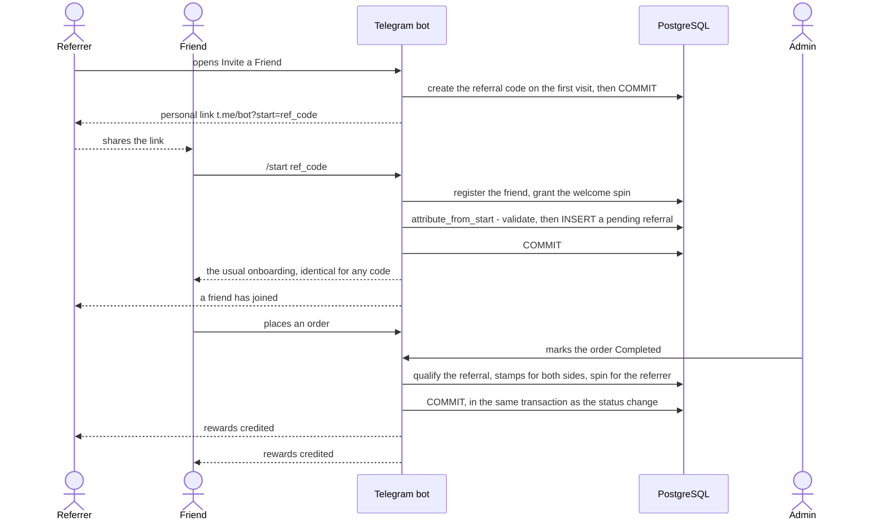

# Referral programme

👥 Invite a Friend gives every customer a personal Telegram link. A friend who
has **never ordered** opens the bot through it; when that friend's **first
completed, paid order** is completed, both sides receive stamps and the referrer
a roulette spin. Nothing is paid at sign-up.

| Reward | Recipient | Setting (default) |
|---|---|---|
| Stamps | the referrer | `REFERRAL_REWARD_STAMPS` (`2`) |
| Stamps | the referred customer | `REFERRED_USER_START_STAMPS` (`2`) |
| Roulette spin | the referrer | `REFERRAL_SPINS` (`1`; `0` disables) |

## Flow

## Personal links and codes

- A customer's code is created on their first visit to 👥 Invite a Friend
  (`ReferralProgramService.invitation`, `app/services/referral_program.py`) and
  stored once in `loyalty_accounts.referral_code` (unique). It is
  `secrets.token_urlsafe(9)` — 12 URL-safe characters, 72 random bits — never
  derived from a user id, and it never expires.
- The link is a Telegram deep link, `https://t.me/<bot_username>?start=ref_<code>`,
  using the bot username from the cached `getMe`.
- The screen offers 📤 Send to a friend (Telegram's own share sheet,
  `https://t.me/share/url`) and 📋 Copy link (a `copy_text` button); its only
  callback closes the screen. The code is created and committed before the screen
  is sent, so a link never names an unsaved code.

## Attribution (`/start ref_<code>`)

`cmd_start` (`app/handlers/user/start.py`) passes whatever follows `/start` to
`ReferralProgramService.attribute_from_start`, the only attribution entry point.
It **never raises for client input**; every case is an outcome:

| Outcome | When | Written |
|---|---|---|
| `attributed` | valid code, new customer, no loop | a `pending` referral |
| `not_a_referral` | no payload, a malformed one (`REFERRAL_CODE_PATTERN`), or another kind | nothing |
| `unknown_code` | well-formed code nobody owns | nothing |
| `self_referral` | the customer's own code | nothing — they are told their link works |
| `not_new_customer` | the customer has already placed an order | nothing |
| `already_referred` | the customer already has a referrer — the first one is kept forever | nothing |
| `loop` | the referral would close a loop anywhere up the chain | nothing |

- The newcomer's replies are **identical whatever the code**, so a guesser learns
  nothing about which codes exist. Only a customer opening their own link — who
  owns the code — is told it works.
- One referrer per customer: `referrals.referred_user_id` is unique, and
  `CHECK (referrer_user_id <> referred_user_id)` backs the self-referral check.
- Attributions are serialised by a PostgreSQL advisory lock
  (`ReferralRepository.lock_attributions`), so two new customers opening each
  other's links at the same moment cannot refer each other.
- Placing a first order and attributing a referral both take the customer's
  account lock: an order in flight either commits before attribution asks
  whether the customer has ever ordered, or waits until it is decided.
- The `Referral` model refuses changes to its parties or its qualifying order,
  and any step back from `qualified`.

## Payout

`AdminOrderService.change_order_status` → `ReferralProgramService.settle_for_completed_order`,
after the stamp award and the milestone spin, in the **same transaction** as the
status change:

1. The referred customer's first `Completed`, paid, post-launch order qualifies
   the referral (the referral row is locked; `qualifying_order_id` is unique).
2. Each side receives its stamps — one `referral` ledger row per side, unique on
   `(referral_id, user_id)`.
3. The referrer receives the spin — unique on `(referral_id, user_id)` in
   `roulette_spin_grants`.

A replayed completion, a second order or a concurrent completion pays nothing
more. If anything fails, the status change and the payout roll back together.

## Notifications

`ReferralNotificationService` (`app/services/referral_notification.py`) tells the
referrer when a friend joins (after the `/start` commit) and tells both sides when
the payout lands (after the status-change commit; amounts are read back from the
ledger by `ReferralProgramService.payout_for_order`). No message names the other
side, and delivery failures are logged and swallowed — they can never undo the
reward.

## Abuse resistance and its limits

- Paying only at the referred customer's first **paid, completed** order means a
  second Telegram account earns nothing on its own: an admin has to complete a
  real order.
- Loops, self-referrals and re-attribution are refused as described above.
- Deliberately out of scope: detecting one person operating several Telegram
  accounts that each place real orders. Orders are completed by an admin, which
  is the practical control.

## Tests

`tests/test_referrals.py` (attribution outcomes, payout, notifications),
`tests/test_invite_ui.py` (the screen and share buttons),
`tests/test_rewards_and_referrals.py`, `tests/test_loyalty_attacks.py`,
`tests/test_loyalty_guards.py` (the advisory lock is taken before the insert) and
the concurrent attribution and payout races in `tests/test_loyalty_concurrency.py`.
