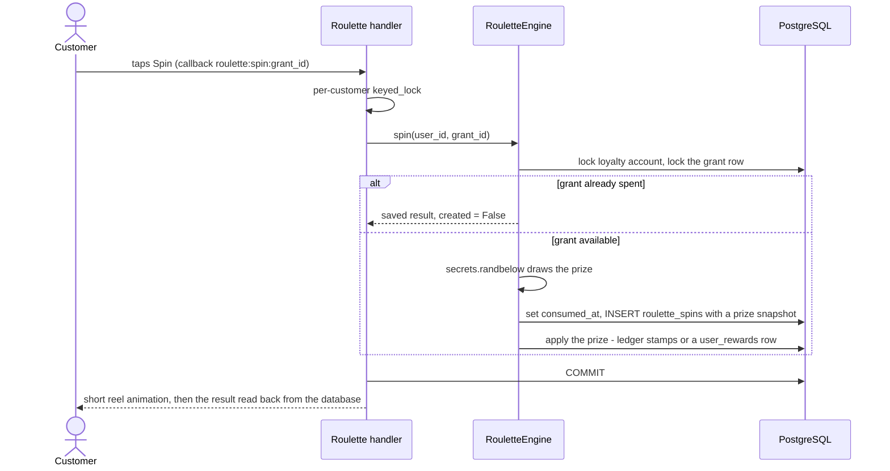

# Lucky Roulette

🎰 Lucky Roulette lets a customer spend a **spin** on a prize drawn by the server:
stamps for the [Stamp Card](loyalty.md), a percentage discount, or a free bottle.
Spins are earned, never bought; every spin and every prize is persisted.

## Where spins come from

`SpinEntitlementService` (`app/services/spin_entitlement.py`) decides which
activity earns a spin. Every spin is a `roulette_spin_grants` row naming its
reason and source — the audit trail — and a unique constraint per source keeps
each source to a single grant.

| Source | Granted when | Setting (default) | Idempotency key |
|---|---|---|---|
| **Welcome spin** (`initial_promo`) | At `/start` | `ROULETTE_INITIAL_FREE_SPIN` (`true`) | partial unique index: one `initial_promo` grant per user |
| **Existing-user activation** | Every bot start backfills the welcome spin (and the loyalty account) for any customer still without one — `activate_loyalty` → `LoyaltyActivationService.activate_everyone`, one `INSERT … SELECT … ON CONFLICT DO NOTHING` | same | same |
| **Every Nth qualifying purchase** (`purchase_milestone`) | When the admin completes the order, right after the stamp award, in the same transaction | `ROULETTE_SPIN_EVERY_N_PURCHASES` (`5`; `0` disables) | `roulette_spin_grants.order_id` |
| **Referral** (`referral`) | To the referrer, when their referral qualifies | `REFERRAL_SPINS` (`1`; `0` disables) | `(referral_id, user_id)` |

Notes:

- The loyalty migration (`3b9d6f2a8c14`) granted one welcome spin to every
  customer who existed at launch; the startup backfill catches up anyone
  registered or left behind since. Nobody ever receives a second welcome spin —
  including after restarts and redeploys.
- A *qualifying purchase* is a purchase row in the stamp ledger: a `Completed`
  order, placed after launch, charged more than €0 (see
  [Loyalty](loyalty.md#how-stamps-are-earned)). Milestones are numbered from those
  ledger rows under the customer's account lock, so orders completing at the same
  time receive distinct numbers. The interval in force when an order completes
  decides; changing it never grants spins for past purchases.

## Prizes and weighted selection

The prizes are defined in code — `PRIZE_CATALOGUE` in `app/services/roulette.py` —
and their weights in configuration:

| Prize code | Prize | Weight setting | Default weight | Default chance |
|---|---|---|---|---|
| `stamp_1` | +1 stamp | `ROULETTE_PRIZE_STAMP_1_WEIGHT` | 40 | 40% |
| `stamp_2` | +2 stamps | `ROULETTE_PRIZE_STAMP_2_WEIGHT` | 25 | 25% |
| `discount_5` | 5% off one order | `ROULETTE_PRIZE_DISCOUNT_5_WEIGHT` | 20 | 20% |
| `discount_10` | 10% off one order | `ROULETTE_PRIZE_DISCOUNT_10_WEIGHT` | 10 | 10% |
| `free_bottle` | one free bottle up to `LOYALTY_FREE_BOTTLE_MAX_PRICE` | `ROULETTE_PRIZE_FREE_BOTTLE_WEIGHT` | 5 | 5% |

A prize's chance is its weight divided by the sum of all weights (the defaults
add up to 100, so they read as percentages). A weight of `0` removes the prize;
at least one weight must be above `0`, and none may be negative or above
1,000,000 — otherwise the bot refuses to start.

**The server decides.** `RouletteEngine` (`app/services/roulette_engine.py`) draws
one integer ticket with `secrets.randbelow(total_weight)` — the operating system's
CSPRNG — and walks the cumulative weights, so every chance is exact. The engine
requires its policy, so the configured odds can never be bypassed, and
`RouletteService.spin` refuses any prize outside `PRIZE_CATALOGUE`. The client
never supplies a prize, type, value or balance.

## Spending a spin

- **One transaction.** Locking, consuming the grant, recording the spin (a
  snapshot of the prize, so later configuration changes never rewrite history)
  and applying the prize happen together; a failure rolls all of it back and the
  spin stays available.
- **Once per grant.** The callback names the grant the screen offered
  (`RouletteEngine.next_grant_id`), and `roulette_spins.grant_id` is unique. A
  double tap, a stale screen or the same Telegram update processed again after a
  restart finds the grant spent and is shown its saved result (`created=False`).
  An id that is not the customer's spends nothing.
- **Committed before it is shown.** The prize is durable before the suspense
  animation starts, and the result is read back from the saved spin and reward.
- **Real prizes.** Stamps become a `roulette` ledger row (`spin_id` unique); a
  discount or free bottle becomes a `user_rewards` row (`spin_id` unique), redeemed
  once at checkout exactly like a stamp-card free bottle — see
  [Redeeming rewards at checkout](loyalty.md#redeeming-rewards-at-checkout). Won
  discounts and bottles do not expire.

Ownership is also enforced by the database: `roulette_spins` references its grant
by `(grant_id, user_id)` onto `(id, user_id)`, so a spin can never consume another
customer's grant.

## The 🎰 Lucky Roulette screen

`app/handlers/user/roulette.py` shows what the backend reports: spins available,
the qualifying purchases still needed for the next milestone spin
(`SpinEntitlementService.purchases_to_next_spin`), and the prizes currently in the
wheel (weight above `0`). With a spin, 🎰 Spin! carries only the grant id; without
one, 🛍 Catalog is offered. After a spin the screen shows the prize, the updated
stamp progress or the reward saved, and either 🎰 Spin again or the countdown to
the next spin. A database failure during a spin is rolled back and the customer is
told nothing was lost; the same button retries safely.

## Configuration summary

| Variable | Default | Effect |
|---|---|---|
| `ROULETTE_INITIAL_FREE_SPIN` | `true` | welcome spin at `/start` and in the startup backfill |
| `ROULETTE_SPIN_EVERY_N_PURCHASES` | `5` | a spin on every Nth qualifying purchase; `0` disables |
| `REFERRAL_SPINS` | `1` | spins for the referrer per qualified referral; `0` or `1` |
| `ROULETTE_PRIZE_*_WEIGHT` | 40 / 25 / 20 / 10 / 5 | prize weights, see above |
| `LOYALTY_FREE_BOTTLE_MAX_PRICE` | `20.00` | price cap of a free-bottle prize |

Details and validation rules: [Configuration](configuration.md#roulette-spins).

## Tests

`tests/test_roulette_engine.py` (draw, weights, replay, refusals),
`tests/test_roulette_persistence.py`, `tests/test_roulette_ui.py` (the screen and
its callbacks), `tests/test_spin_entitlements.py` (every grant source, exactly
once), `tests/test_loyalty_guards.py` (lock order of a spin) and the PostgreSQL
races in `tests/test_loyalty_postgres.py`.
